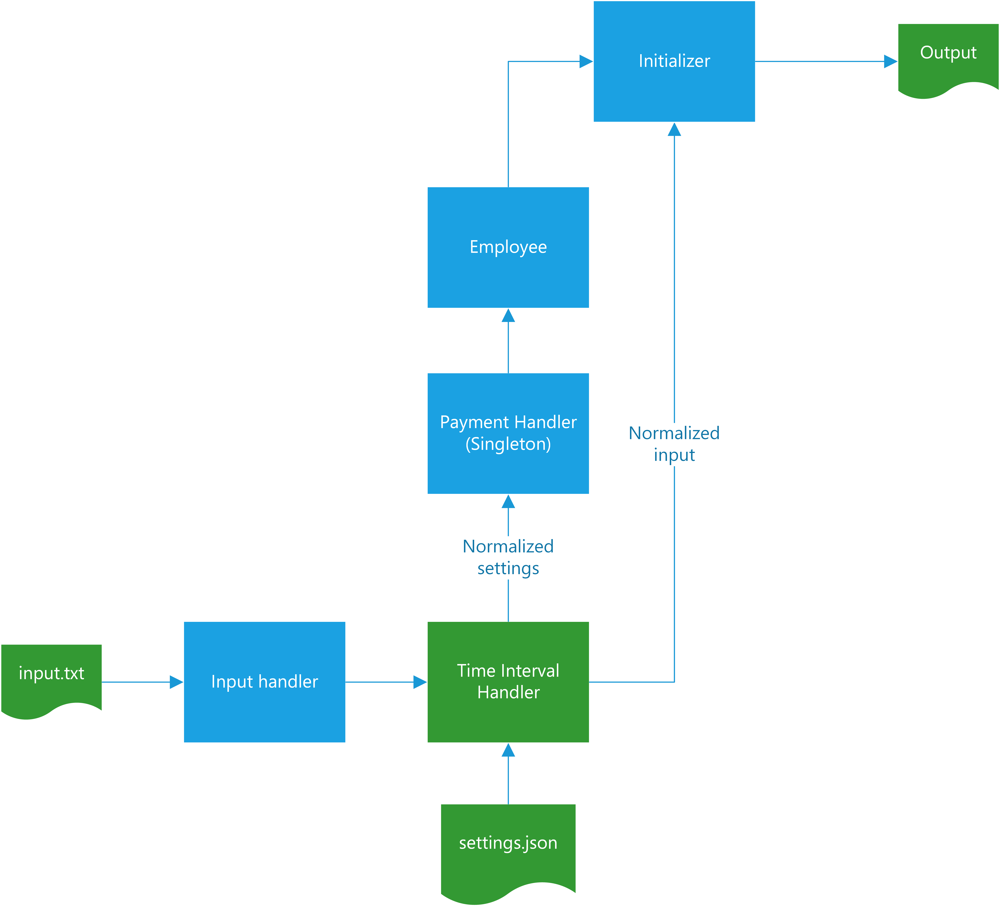

# ACME - Salary calculation
ACME has decided to develop an application to calculate the amount in USD to pay an employee, based on the quantity of hours and the time they worked. Therefore, the hour fee is calculated based in the table below:

| Time segments \ Day (Acronym)         | Monday (MO) | Tuesday (TU)  | Wednesday (WE)  | Thursday (TH) | Friday (FR) | Saturday (SA) | Sunday (SU) |
| :----:                | :----:      | :----:        | :----:          | :----:        | :----:      | :----:        | :----:      |
|00:01 - 09:00          |25           |25             |25               |25             |25           |30             |30           |
|09:01 - 18:00          |15           |15             |15               |15             |15           |20             |20           |
|18:01 - 00:00          |20           |20             |20               |20             |20           |25             |25           |

### Requirements
In order to run this application ```Python 3.7``` is required. No third-party libraries are needed. 

### Running the application
Before you run the aplication, you may want to register some data about your employees in ```employees_input.txt```. Make sure that the format of your entries is correct.

Input sample format: ```ASTRID=MO10:00-12:00,TH12:00-14:00,SU20:00-21:00```

Make sure you:
- Include a name
- Separate name and body with ```=```
- Include at least one day in the body. Use ```,``` to separate each day
- Take day acronyms from the table above.
- Separate start and end time values with ```-```
- Insert valid time values: ```from 00:01 to 24:00```

To run the aplication, execute this in your terminal: ```$ python src/app.py```

## For administrators
At the moment, payment fees are calculated based in the table at the top. If these rules are changed, please refer to ```config/payment_settings.json``` and update the JSON file according to the new rules.

Make sure that time segments:
- Do not overlap.
- Fill all day without leaving time gaps. Must fill ```from 00:01 to 24:00```
- Have valid time values

## Structure Overview
The following chart shows the basic the behavior of the application.
<p align="center">

</p>

### Input handler
This service is responsible of pre-processing the data to be sent to Time Interval handler. Its key feautures are:
- Validate correct input format
- Struct and normalize data. For example, input ```ASTRID=MO10:00-12:00,TH12:00-14:00,SU20:00-21:00``` normalizes to: 
```json
{
    "label": "ASTRID",
    "value": {
      "MO": [
        {
          "start_time": 1000,
          "end_time": 1200
        }
      ],
      "TH": [
        {
          "start_time": 1200,
          "end_time": 1400
        }
      ],
      "SU": [
        {
          "start_time": 2000,
          "end_time": 2100
        }
      ]
    }
  }
  ```


### TIme Interval Handler
This services handles time intervals seen both in ```employees_input.txt``` and ```config/payment_settings.json```.
This service main features are to:
- Check that time segments do  not overlap
- Optionally, check that time segments fill all day
- Arrange time segments in ascending order
- Check if day acronym is valid.
- Find the index of time segment that input time value belongs to.
- Calculate time difference in hours

### Payment Handler
This sub-domain was built using the Singleton pattern since payment settings are static. Therefore, this domain is responsible of calculating the payment amount that the employee is to be given based on the payment settings and the employee worked-day summary to be fed by the Employee domain.

### Employee
At the moment, this domain contains with the employee's name and his worked-day summary. In this way, it gets the amount the employee is to be paid using the Singleton instance of Payment Handler. Finally, it decorates the final result so that the output is similar to: ```The amount to pay RENE is: 215.00 USD```

## Testing
### Run the tests
```console
$ python -m pytest
```
Eleven tests have been written in order to test domains, subdomains (units), services, and integrations.
